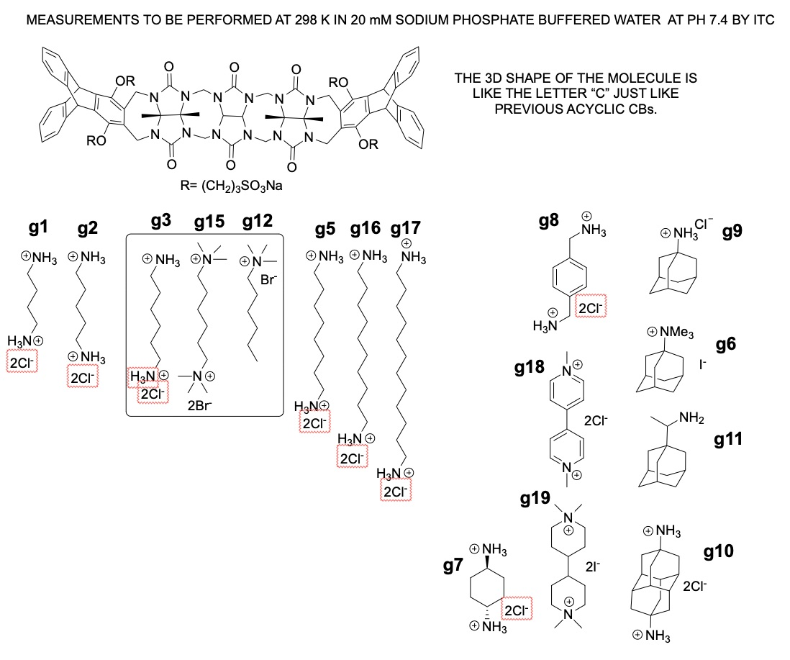

# The SAMPL7 TrimerTrip Challenge

For SAMPL7, the Isaacs group is contributing binding data for roughly ten guests to a CB-like clip molecule highlighted in the attached documents. This host is codenamed TrimerTrip.

## Challenge timing details

Data collection for the TrimerTrip challenge is complete or nearly so, as of Aug. 2016, and a paper is to be submitted this fall. The challenge deadline (so as to not delay publication) is therefore Oct. 4, 2019.
The challenge consists of predicting binding free energies of all 15 guests to TrimerTrip. Optionally, binding enthalpies may also be submitted, as these are being measured.

## A quick view of the host and guests

## Disclaimer

Note that we have typically selected reasonable protonation states and conformers of the host and guests, but these may be controversial, uncertain, or change upon binding, so participants are encouraged to exercise care in selecting which states are modeled. In this case in particular, the host structure was [simulated for a period of time](host_files/README.md) in the absence of any guests prior to deposition, which may or may not mean that additional equilibration is needed in the presence of guests before conducting binding free energy calculations.

# What's here

- Hosts: `host_files`: Folder containing PDB, MOL2, SDF and Chemdraw files for the TrimerTrip host. Contains a detailed description of input file generation for the TrimerTrip host.
- Guests: `guest_files`: Folder containing files for the 15 guests, SMILES strings, and the jupyter notebook used to generate PDB, MOL2 and SDF files of the guests.
- Images: `images`: Folder containing an image of the guest and host structures for this challenge in JPG file format.
- Submission format: `Clip_submission.txt`: Example submission file (please replace the text and values with your own!) for submitting to our system. Visit [host_guest_instructions.md](../host_guest_instructions.md) for submission instructions. Filenames must begin with "Clip".

**Source files**
In this case the original source files provided were:
- `guest_files/SAMPL7.cdx`, from Lyle Isaacs, providing a 2D structure of the host and all of the guests
- A (not deposited) `.cif` crystallographic file of the host, from which we prepared the host structure and checked it against the 2D structure.
