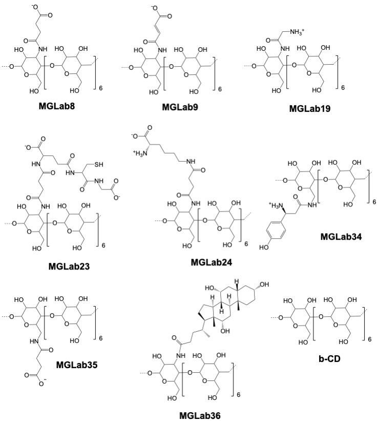
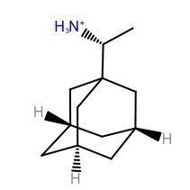
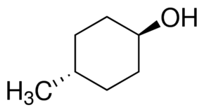

# The SAMPL7 Cyclodextrin Derivatives Challenge

For SAMPL7, the Gilson group is contributing binding data for two hosts (r-rimantadine and trans-4-methylcyclohexanol) binding to beta-cyclodextrin as well as eight novel cyclodextrin derivatives synthesized by Gilson postdoc Katy Kellett.

## Challenge overview

The challenge consists of predicting binding free energies (and, optionally, enthalpies of binding) of two guests to the series of modified cyclodextrin hosts shown below.

Above, R-rimantadine

Above, trans-4-methylcyclohexanol

We plan to separately analyze submissions predicting absolute binding free energies of individual guests to individual hosts, and predictions of relative binding free energies of a single guest to a series of hosts.

[Full experimental details are available elsewhere in this repository.](../../host_guest_description.md)

## Challenge timing details

Dr. Kellett has finished the ITC data collection on guest binding and [full experimental details are available](../../host_guest_description.md). Participants may begin their calculations and submissions will be allowed as soon as our submission system is online. The formal challenge deadline is available on the main page for this repository.

### Additional technical details

Binding in all systems was assayed in 25 mM pH 6.8 sodium phosphate buffer at 27 Celsius. All systems exhibit 1:1 binding except that one may end up being a nonbinder. NMR is being done in the hopes of assessing the preferred orientation of the bound guests.
Compounds exhibiting strange binding patterns have already been removed prior to construction of this set.
[Full experimental details are available.](../host_guest_description.md)

### Disclaimers

Note that we have typically selected reasonable protonation states and conformers of the hosts and guests, but these may be controversial, uncertain, or change upon binding, so participants are encouraged to exercise care in selecting which states are modeled.

# What's here

- Hosts: `host_files`: Folder containing beta cyclodextrin plus the eight other cyclodextrin derivative hosts, provided by Katy Kellett and Michael Gilson, initially only in PDB format with all protons present. The Chemdraw files are also provided. MOL2 and SDF files of the hosts were added on 7/18/19.
- Guests: `guest_files`: Contains MOL2, PDB and SDF files and files containing the isomeric SMILES strings and codenames of the guests.
- Images: `images`: Folder containing images of the guest and host structures for this challenge in JPG and PDF format.
- Submission format: `CD_submission.txt`: Example submission file (please replace the text and values with your own!) for submitting to our system. Visit [host_guest_instructions.md](../host_guest_instructions.md) for submission instructions. Filenames must begin with "CD".

**Source files**:
- PDB files of all hosts from the Gilson lab, which served to generate host sdf and mol2 files
- SMILES strings for the guests, which were used to generate PDB and SDF files for the guests, as well as names

**Auxiliary files**:
- ChemDraw files of all hosts from the Gilson lab
- mol2 files for the guests from the Gilson lab
